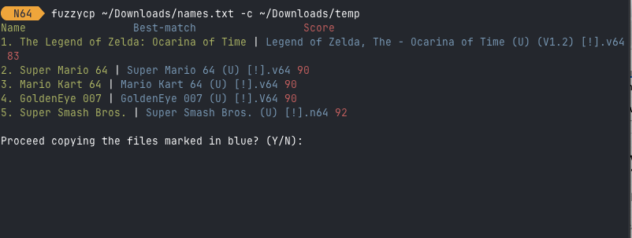

# `fuzzycp`: Fuzzy file operations (`mv`, `cp`) 

fuzzycp performs file operations such as copy and move on files whose filenames match a list. The matching is fuzzy, in other words there is an approximate match. 


## The problem of fuzzy matching

In order to understand what that means, here is a concrete example. 

Suppose you have a file `names.txt` containing a list of names you want to match against. Let's say the content of this file is:

```
1. The Legend of Zelda: Ocarina of Time
2. Super Mario 64
3. Mario Kart 64
4. GoldenEye 007
5. Super Smash Bros.
```

This is a random example—the top five games released for the Nintendo 64 console. Now, you have a directory with thousands of files, and you want to copy to another directory only the files that are the best-match to the names in the above list. Here are some examples of files in that directory:

```
'Spider-Man (U) [!].v64'
'StarCraft 64 (U) [!].v64'
'Starfox 64 1.1 (U).v64'  
'Starshot - Space Circus Fever (U) [!].z64'
'Star Wars - Rogue Squadron (U) [!].v64'
'Star Wars - Shadows of the Empire (U) (V1.2) [!].v64'
'Star Wars Episode I - Battle for Naboo (U) [!].v64'
'Star Wars Episode I - Racer (U) [!].v64'
'Stunt Racer 64 (U) [!].z64'
'Super Bowling 64 (U) [!].z64'
'Supercross 2000 (U) [!].z64'
'Superman (U) (M3) [!].z64'
'Super Mario 64 (U) [!].v64'
```

For the sake of our example, the content of these files is meaningless (let's say they have the metadata for those games). Notice that there will be no exact match between the names in `names.txt` and the actual filenames. They could have different casing, missing text, extra letters etc. This is where the power of fuzzy matching shines: *you don't need an exact match*.

## The solution

Normally people would do this sort of thing by manually selecting file by file and copying them. Not anymore. Here is how you solve this using `fuzzycp`. First `cd` to the directory containing the files.

Copy only the best-matching files to directory `dest/directory`:

    fuzzycp names.txt -c dest/directory



Move only the best-matching files to directory `dest/directory`:

    fuzzycp names.txt -m dest/directory

Print the best-matching files and the matching score:

    fuzzycp names.txt 

Print the best-matching files, and the space they occupy:

    fuzzycp names.txt -s


## Installation

TBD

```shell
brew install fuzzycp

pip install fuzzycp
```

## How it works

fuzzycp uses the [RapidFuzz library—a fast, lightweight C++ library—](https://github.com/rapidfuzz/RapidFuzz)for fuzzy matching, i.e. measuring how similar two strings (or other sequences) are and finding the best match in a collection. 

Internally, fuzzycp compares the names using the `WRatio` scorer, which internally tries `ratio`, `partial_ratio`, `token_sort_ratio`, and `token_set_ratio` and picks the highest — making it robust for partial or reordered names. The scorer can easily be swapped in `file_matching()` for any other RapidFuzz scorer.

## TBD

- [ ] Homebrew recipe
- [ ] pip install recipe
- [x] move files functionality
- [ ] windows standalone EXE
- [ ] add multi-disk mode